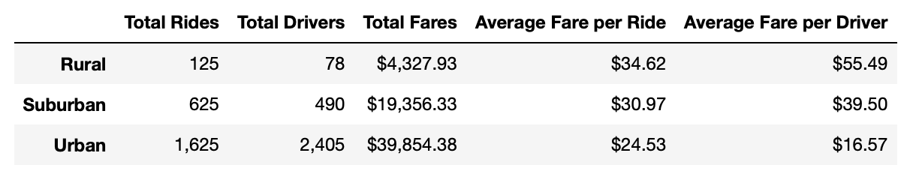
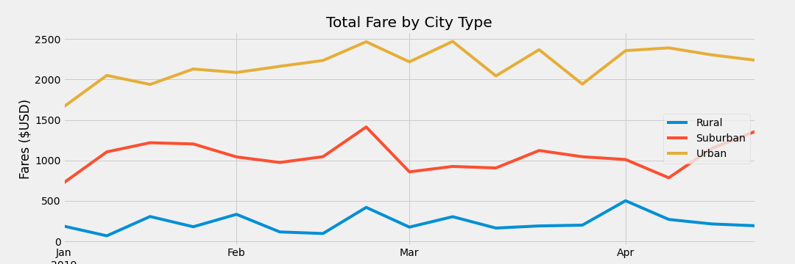

# PyBer_Analysis
## Overview
Using the provided ride-sharing data by city type, determine any recommendations for the Pyber CEO to address any disparities among the different city types.

## Results
Based on the Summary Data Frame below, we can see that each city type has the following statistics:

Rural
* Total Rides: 125
* Total Drivers: 78
* Total Fares: $4,327.00
* Average Fare per Ride: $34.62
* Average Fare per Driver: $55.49
* Calculated Rides Per Driver:
* Calculated Fare Total Per Driver:

Suburban
* Total Rides: 625
* Total Drivers: 490
* Total Fares: $19,356.33
* Average Fare per Ride: $30.97
* Average Fare per Driver: $39.50
* Calculated Rides Per Driver:
* Calculated Fare Total Per Driver:

Urban
* Total Rides: 1,625
* Total Drivers: 2405
* Total Fares: $39,854.38
* Average Fare per Ride: $24.53
* Average Fare per Driver: $16.57
* Calculated Rides Per Driver:
* Calculated Fare Total Per Driver:

### Summary Data Frame

### Total Fare by City Type

## Summary

1. 
2.
3.

