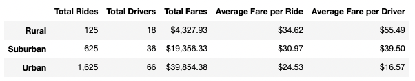

# PyBer_Analysis
## Purpose
Using the provided ride-sharing data by city type, determine any recommendations for the Pyber CEO to address any disparities among the different city types.

## Background

## Analysis
Based on the Summary Data Frame below, we can see that each city type has the following statistics:

Rural
* Total Rides: 125
* Total Drivers: 18
* Total Fares: $4,327.00
* Average Fare per Ride: $34.62
* Average Fare per Driver: $55.49
* Calculated Rides Per Driver: 6.94

Suburban
* Total Rides: 625
* Total Drivers: 36
* Total Fares: $19,356.33
* Average Fare per Ride: $30.97
* Average Fare per Driver: $39.50
* Calculated Rides Per Driver: 17.36

Urban
* Total Rides: 1,625
* Total Drivers: 66
* Total Fares: $39,854.38
* Average Fare per Ride: $24.53
* Average Fare per Driver: $16.57
* Calculated Rides Per Driver: 24.62

### Summary Data Frame

### Results
Suburban areas are more profitable on a fare per driver than Urban and Rural. However, Urban areas 

### Total Fare by City Type

## Summary

### Recommendations

1.
2.
3.
